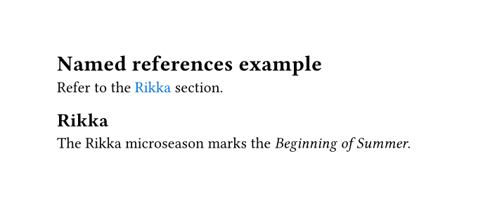
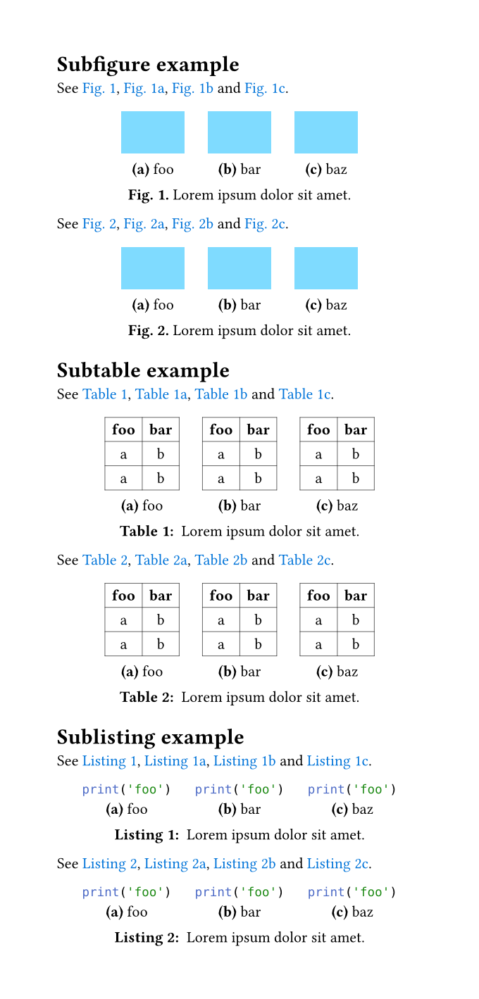
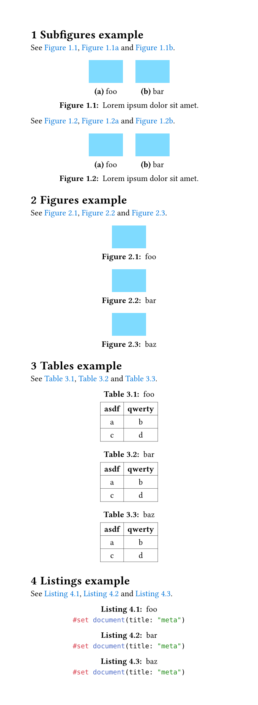
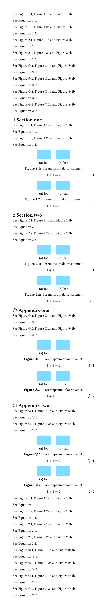
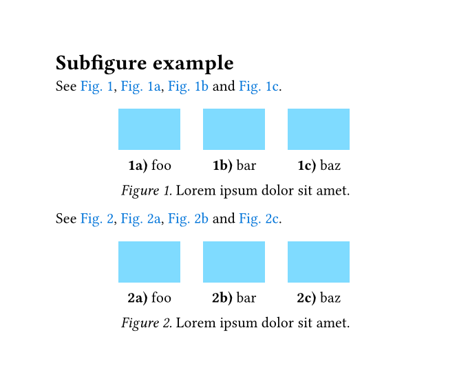
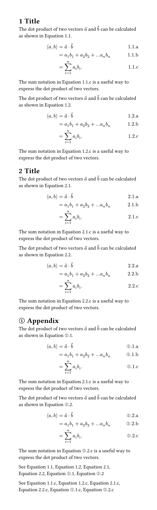
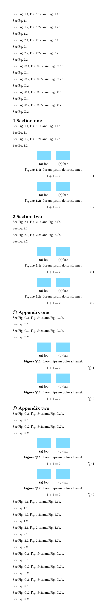

# hallon

A collection of utility functions for Typst.

## Named references example

See [tests/example-nameref/test.typ](tests/example-nameref/test.typ).



## Subfigures example

See [tests/example-subfig/test.typ](tests/example-subfig/test.typ).



## Heading-dependent numbering of figures and equations

See [tests/example-figs/test.typ](tests/example-figs/test.typ).



See [tests/example-appendix/test.typ](tests/example-appendix/test.typ).



## Custom figure and subfigure caption style

See [tests/example-custom-caption/test.typ](tests/example-custom-caption/test.typ).



## Heading-dependent numbering of equations integrated with `equate` package

See [tests/example-integration-equate/test.typ](tests/example-integration-equate/test.typ).



## Heading-dependent numbering of figures and equations with custom `ref` show rule

See [tests/example-ref-show-rule/test.typ](tests/example-ref-show-rule/test.typ).



## Etymology

Hallon (`ˈhàlɔn`) means raspberry in Swedish, a befitting name for a package that contains *"lite smått och gott"*.

## Development

```bash
cargo install --locked --git https://github.com/mohe2015/tytanic --branch custom-typst
TYPST_PACKAGE_PATH=$PWD/packages tt run
```

Start your editor with `TYPST_PACKAGE_PATH=$PWD/packages` set.
